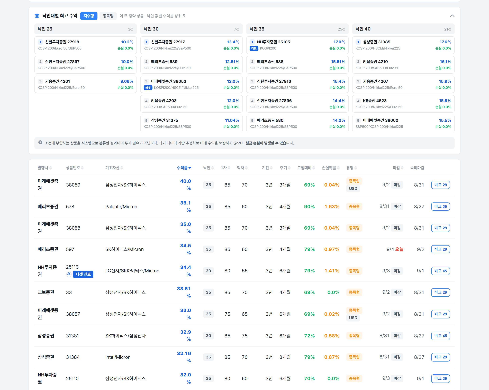
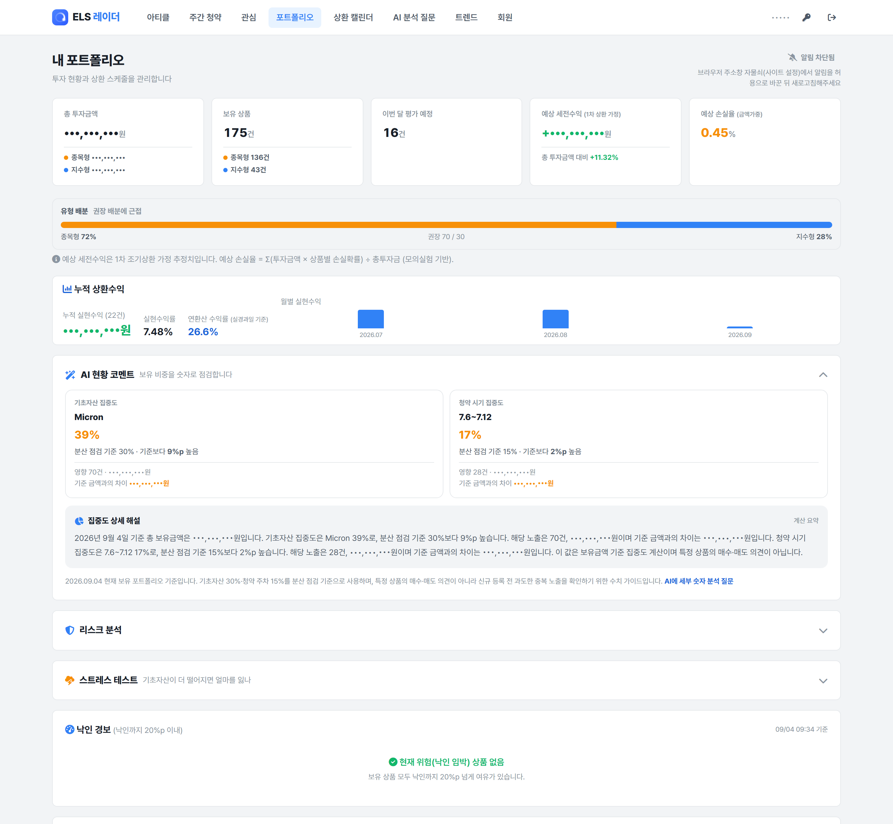
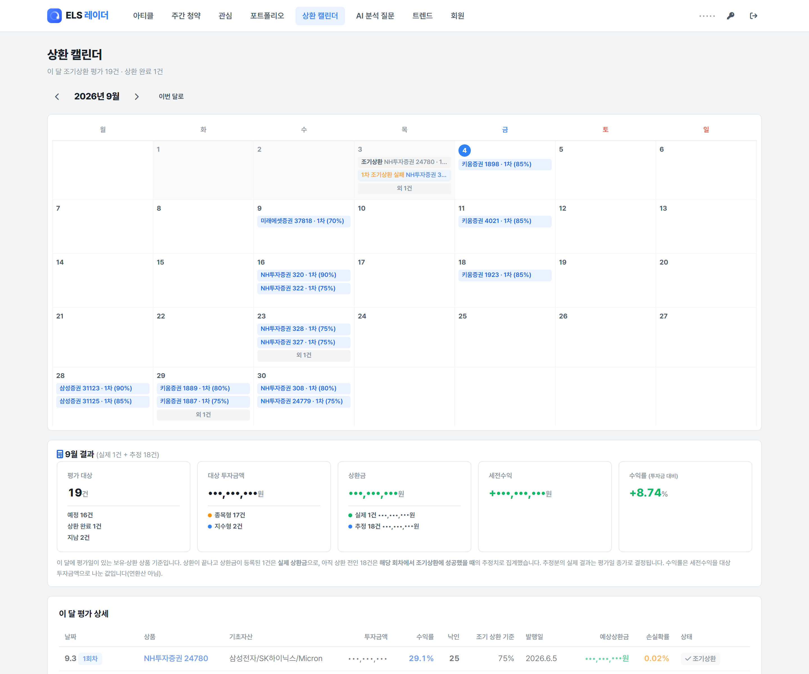

# 카페 3편 — ELS 175건 관리 도구 소개 (확정본)

- 상태: **확정** — 스크린샷 3장 확보·마스킹 완료, 게시 가능
- 게시처: 네이버 카페 **「은퇴후 50년」** (1·2편을 올린 카페와 다름)
- 성격: 1·2편을 안 본 독자도 이해되도록 전부 자체 완결로 다시 씀. 은퇴·노후 준비층 대상으로 톤 조정

## 제목 후보

1. **은퇴 후 현금흐름, 저는 ELS 175건을 쪼개서 만들고 있습니다** ← 현재 본문에 적용 (확정)
2. ELS 175건 들고 있으면, 사람이 관리가 안 됩니다
3. ELS 175건 관리하다가 결국 직접 도구를 만들었습니다 (화면 공개)
- 이미지: `docs/assets/` 에 3장 (아래 원고에 삽입 위치 표시)
  - `els-weekly-screening.png` — 주간 청약, 낙인대별 최고 수익 + 수익률 정렬 표
  - `els-portfolio.png` — 내 포트폴리오 (모든 금액 마스킹)
  - `els-calendar.png` — 상환 캘린더 (모든 금액 마스킹)
- 미사용: 랜딩 히어로 화면(베타 배지 + 가입 CTA). 광고성으로 보여 카페 홍보 금지 규정에 걸릴 소지가 있어 제외

## 마스킹 처리 내역

| 항목 | 처리 |
|---|---|
| 총 투자금액, 예상 세전수익, 누적 실현수익, 대상 투자금액, 상환금, 예상상환금 등 **백만 원 단위 이상 모든 금액** | `•••,•••,•••` 로 치환 |
| 우상단 계정명 `admin` | `•••••` 로 치환 |
| 비율·건수(+11.32%, 0.45%, 175건, 136/43건, +8.74%) | **유지** — 금액이 아니라 절대값 유추 불가 |

---

## 확정 원고

# 은퇴 후 현금흐름, 저는 ELS 175건을 쪼개서 만들고 있습니다

안녕하세요. ELS만 몇 년째 하고 있는 사람입니다.

이 카페에는 은퇴 이후에 **매달 얼마가 언제 들어오는지**를 만들어두는 게 제일 큰 숙제인 분들이 많으실 것 같습니다. 저도 그 관점에서 ELS를 쓰고 있어서, 제가 실제로 어떻게 굴리고 관리하는지를 화면까지 열어서 공유드리려고 합니다.

먼저 분명히 해둘 게 있는데, **ELS는 원금이 보장되는 상품이 아닙니다.** 예금처럼 생각하시면 안 되고, 조건이 어긋나면 원금 손실이 납니다. 그래서 아래 내용은 "이렇게 하면 안전하다"가 아니라 "손실 확률을 어떻게 관리하고 있나"에 대한 이야기입니다.

제 결론부터 말씀드리면 ELS는 한 상품에 몰아넣는 것보다 **시기를 나눠서 담는 게 낫다**는 겁니다. 그 원칙대로 계속 사다 보니 지금 보유 중인 게 **175건**이 됐습니다.

처음엔 엑셀로 관리했는데, 100건 넘어가니까 한계가 오더라고요. 어떤 게 조기상환 평가일이 다가오는지, 어디에 몰려 있는지, 이번 달에 뭐가 들어오는지를 사람 눈으로 따라가는 게 안 됐습니다. 그래서 그냥 직접 도구를 만들어버렸습니다.

## 매주 쏟아지는 물량부터 걸러야 해요

일단 매주 새로 청약 들어오는 ELS만 해도 200건이 넘습니다. 이번 주만 해도 청약 마감 상품이 221건이었어요.

이걸 낙인 기준으로 25/30/35/40 구간별로 나눠서, 각 구간 안에서 수익률 상위 상품만 자동으로 걸러줍니다.

여기서 하나 짚고 싶은 게, **같은 낙인 구간 안에서 쿠폰이 유독 튀는 상품은 한 번 의심해봐야 한다**는 겁니다. 낙인 조건이 같은데 수익률만 높다면, 그건 공짜가 아니라 기초자산 쪽에 위험을 더 얹어놨다는 뜻이에요. 이렇게 같은 구간끼리 나란히 놓고 보면 뭐가 비정상적으로 튀는지 한눈에 보입니다.

## 175건 쌓이니까 사람이 못 보던 게 보이더라고요

포트폴리오 화면은 이렇게 생겼습니다. (금액은 가렸습니다)

보유 175건에 종목형 136건, 지수형 43건. 예상 세전수익률 +11.32%, 예상 손실율 0.45%.

숫자만 보면 괜찮아 보이는데, 진짜 쓸모는 아래 **AI 현황 코멘트**였습니다.

> **기초자산 집중도 — Micron 39%** (분산 점검 기준 30%보다 9%p 높음)
> **청약 시기 집중도 — 7.6~7.12 구간 17%** (기준 15%보다 2%p 높음)

이거 보고 좀 놀랐습니다. 저는 나름 분산해서 담고 있다고 생각했는데, 특정 종목이랑 특정 주에 저도 모르게 쏠려 있더라고요.

제가 몇 년 하면서 얻은 결론이 **"낙인 몇 %냐보다 언제 샀느냐가 더 무섭다"**는 거였거든요. 낙인 조건이 아무리 넉넉해도 특정 시기에 몰아서 사두면 그 시점 시장이 꺾일 때 한꺼번에 같이 물립니다. 근데 말로는 쉬운데, 실제로 100건 넘게 쌓이면 내가 분산을 잘하고 있는지조차 스스로 확인이 안 돼요. 이런 게 자동으로 잡아주지 않으면 모르고 지나갑니다.

## 상환도 캘린더로 안 보면 놓칩니다

이번 달 조기상환 평가가 19건, 상환 완료가 1건입니다.

이 화면이 저한테는 사실상 **현금흐름 달력**입니다. 175건을 시기를 쪼개서 담아두면, 매달 어딘가에서 평가일이 돌아오거든요. 한 상품에 몰아넣었으면 3년 뒤 딱 한 번 결과를 확인하고 끝이지만, 나눠 담으면 상환이 계속 이어져서 들어오는 시점이 분산됩니다. 은퇴 후 생활비를 생각하시는 분이라면 수익률보다 이쪽이 더 중요할 수 있습니다.

여기서 하나 짚고 싶은 게, 캘린더에 **"1차 조기상환 실패"**라고 표시된 게 있어요. 이거 보고 놀라실 필요 없습니다. 1차 평가일에 조건을 못 채웠다는 뜻이지 손실이 확정된 게 아니고, 그냥 다음 평가일로 넘어가는 것뿐이에요. 심지어 중간에 낙인이 걸렸더라도 만기 평가일에 상환 조건 위로 회복해 있으면 원금과 약정 이자를 그대로 받습니다.

오히려 이렇게 눈에 보이니까 "아 이건 낙인 터진 게 아니라 그냥 다음 차수로 넘어간 거구나"를 헷갈리지 않고 구분하게 됐습니다.

## 정리하면

낙인 잘 보고 시기 나눠서 담는 것까지는 **원칙의 영역**인데, 그게 100건 넘게 쌓이면 그다음부터는 **관리의 영역**이더라고요. 저도 175건 되기 전까지는 몰랐던 부분입니다.

은퇴 이후를 생각하신다면 저는 순서가 이렇다고 봅니다. 첫째, ELS는 원금 보장이 아니니 **전체 자산의 일부로만** 쓰실 것. 둘째, 한 번에 몰지 말고 **시기를 쪼개서** 들어갈 것. 셋째, 건수가 늘면 **상환 일정과 쏠림을 눈으로 볼 수 있게** 해둘 것. 셋째까지 안 하면 첫째 둘째를 지키고 있는지 본인도 확인이 안 됩니다.

이 글은 어떤 상품이나 서비스를 사시라는 게 아니고, 그냥 제가 실제로 이렇게 관리하고 있다는 걸 공유드리는 거예요. 궁금하신 거 있으시면 댓글 남겨주세요.

---

## 게시 전 검토 메모

1. **게시 카페: 「은퇴후 50년」 (확정).** 은퇴·노후 준비층 대상에 맞춰 도입부, 상환 캘린더 단락, 마무리 세 곳을 조정했습니다.
   - 화자는 은퇴자로 꾸미지 않았습니다. ELS 실투자자 그대로 두고 독자만 은퇴 준비층으로 지목하는 방식입니다. 거짓 설정이 들어가면 댓글에서 바로 무너집니다.
   - 은퇴층 대상이라 **원금 비보장 고지를 도입부에 명시**했습니다. 예금 대체로 오해하면 이 카페에서 문제가 커집니다.
   - 상환 캘린더를 "현금흐름 달력"으로 재해석한 단락을 추가했습니다. 이 카페 독자에게는 수익률보다 이쪽이 핵심입니다.
2. **주간 청약 스크린샷 발행사명은 그대로 갑니다 (확정).** 신한투자증권·메리츠증권·키움증권·삼성증권 등 발행사와 상품번호가 노출된 상태로 게시합니다. 다만 본문에서 특정 발행사를 지목해 언급하지는 않습니다.
3. **1·2편 참조를 전부 제거했습니다.** 원래 초안은 "지난 글에서 말씀드렸듯이"가 네 번 나왔는데, 이 글은 1·2편을 올린 곳과 다른 카페용이라 독자가 그 글들을 본 적이 없습니다. 해당 부분을 전부 이 글 안에서 설명이 끝나도록 다시 썼습니다.
4. **랜딩 화면은 넣지 않았습니다.** 베타 배지와 가입 버튼이 있어 홍보 글로 분류될 위험이 큽니다.

## 1·2편과 다르게 만든 지점

| | 1·2편 | 이 글 |
|---|---|---|
| 화자 위치 | "제 투자 원칙을 알려드립니다" | "관리가 안 돼서 도구를 만들었습니다" |
| 근거 | 10년 전수 데이터 통계 | 실제 대시보드 화면 3장 |
| 핵심 사건 | 홍콩 H지수 시점 리스크 | AI가 잡아낸 내 포트폴리오 쏠림 |
| 톤 | 과외선생님식 설명 | 문제→해결 경험담 |

핵심 통찰("시기 분산이 낙인보다 중요하다")은 1·2편과 같지만, 이번엔 말이 아니라 "실제로 쏠려 있던 걸 도구가 들켰다"는 구체적 사건으로 보여줍니다. 문장은 전부 새로 썼습니다.
